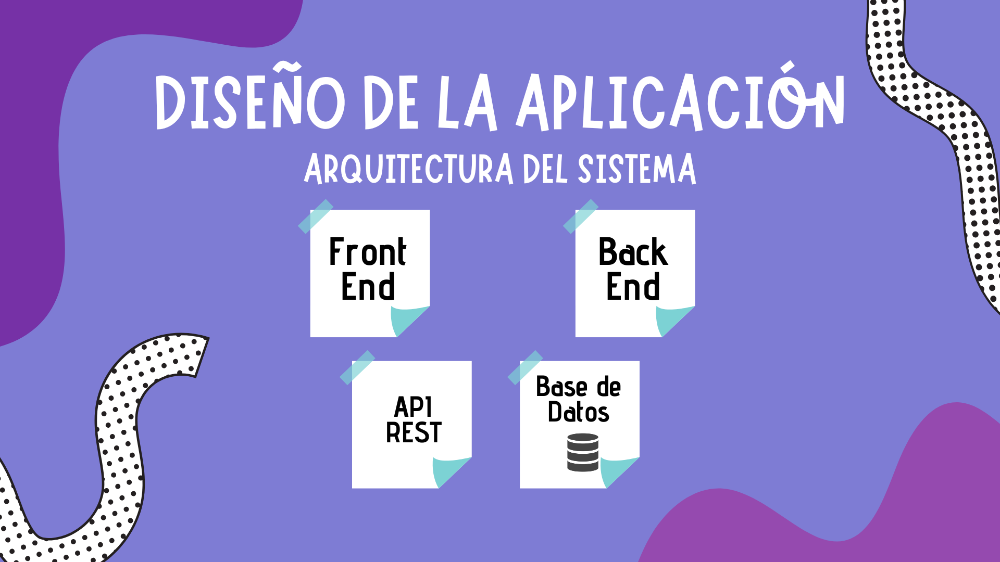
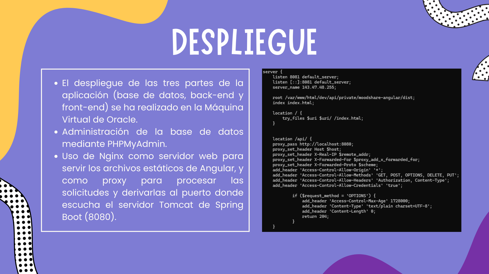
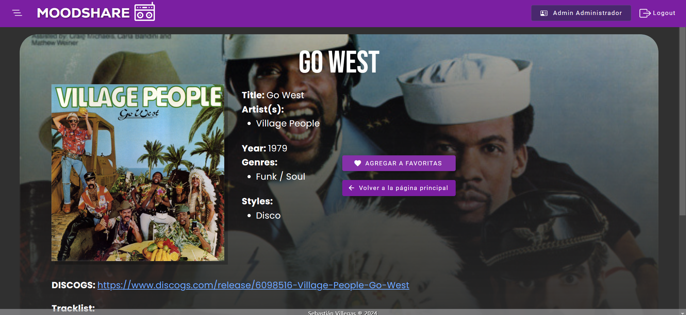
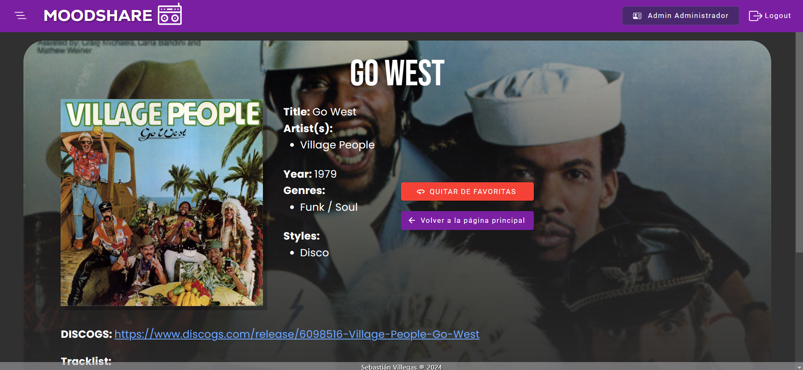

# MoodShare Front-end
> [!NOTE]
> Este proyecto fue generado con [Angular CLI](https://github.com/angular/angular-cli) version 16.2.12.

> [!NOTE]
> También puedes ver el repositorio del [Back-end](https://github.com/sebastianvillegas7/MoodShareBackEnd) de este proyecto.

`MoodShare` es una aplicación inspirada en mi amor por la música y el deseo de compartirlo con los demás, ha sido desarrollada con la idea de combinar esta visión con los conceptos aprendidos durante mi formación académica.

---

## 🚀 Tecnologías Utilizadas

`Angular 16` Framework para el front-end.

`JavaScript` y `TypeScript` Lenguajes para el desarrollo.

`MySQL` Base de datos relacional utilizada para almacenar la información.

`HTML + CSS` & `Bootstrap` Framework CSS para diseño responsivo.

---

## Diseño de la aplicación


---

## Front-end


---

## Back-end


---

## API Rest


---

## Flujo de Operación


---

## Despliegue


---

## üì∏ Capturas de Pantalla







## 🛠️ Instalación y Ejecución
>[!IMPORTANT]
> Aseg√∫rate de tener instalados los siguientes programas en tu sistema:

- **Node.js** (versión 16 o superior): [Descargar Node.js](https://nodejs.org/es)
- **Angular CLI** (versión 16 o superior)
- **Git** (opcional, para clonar el repositorio): [Descargar Git](https://git-scm.com/)
  
> Instalar con el comando:
```
npm install -g @angular/cli
```

--

### 1. Clonar el repositorio
>[!TIP]
> Clona este proyecto en tu m√°quina local utilizando Git:

```
git clone https://github.com/sebastianvillegas7/MoodShareFrontEnd.git
```

### 2. Instalar dependencias
> Ejecuta el siguiente comando para instalar las dependencias necesarias:

```
npm install
```

### 3. Ejecutar el servidor de desarrollo
> Para iniciar la aplicación en modo de desarrollo, ejecuta:

```
ng serve
```

> [!IMPORTANT]
> Luego, abre tu navegador y ve a:

```
http://localhost:4200
```
