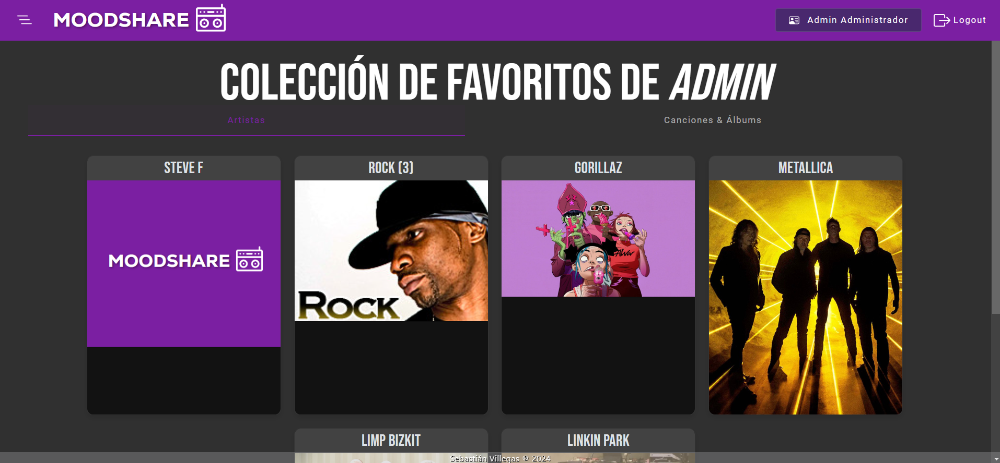

# MoodShare
> [!NOTE]
> Este proyecto fue generado con [Angular CLI](https://github.com/angular/angular-cli) version 16.2.12.

MoodShare es una aplicación inspirada en mi amor por la música y el deseo de compartirlo con los demás, ha sido desarrollada con la idea de combinar esta visión con los conceptos aprendidos durante mi formación académica.

## Diseño de la aplicación

## Front-end

## Back-end

## API Rest

## Flujo de Operación

## Despliegue

## Capturas

## Instalación y Ejecución
>[!IMPORTANT]
> Asegúrate de tener instalados los siguientes programas en tu sistema:

- Node.js (versión 16 o superior): [Descargar Node.js](https://nodejs.org/es)
- Angular CLI (versión 16 o superior): 
Instalar con el comando:
npm install -g @angular/cli
- Git (opcional, para clonar el repositorio): [Descargar Git](https://git-scm.com/)

### 1. Clonar el repositorio
>[!TIP]
> Clona este proyecto en tu máquina local utilizando Git:

git clone https://github.com/sebastianvillegas7/MoodShareFrontEnd.git

### 2. Instalar dependencias
> Ejecuta el siguiente comando para instalar las dependencias necesarias:

npm install

### 2. Ejecutar el servidor de desarrollo
> Para iniciar la aplicación en modo de desarrollo, ejecuta:

ng serve

> Esto iniciará un servidor de desarrollo. Luego, abre tu navegador y ve a:

http://localhost:4200
